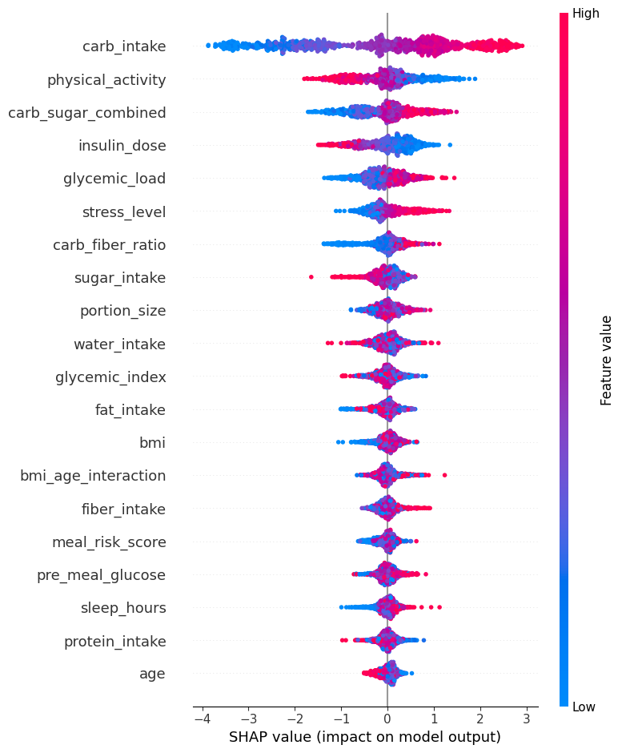

# Predicting Glucose Spikes Using Machine Learning

## Executive Summary

Glucose spikes are a key indicator in the management and progression of Type 2 Diabetes. Early identification of individuals at risk can support proactive intervention, improve patient outcomes, and enable more personalised healthcare strategies.

In this project, I developed a machine learning solution to predict glucose spike risk using dietary, physiological, and lifestyle factors. Using a dataset of 5,000 patient records, I trained and evaluated multiple classification models and applied Explainable AI (SHAP) to understand the factors driving model predictions.

The project demonstrates how predictive analytics can move beyond reporting historical outcomes to supporting proactive healthcare decision-making.

## Business Problem

Type 2 Diabetes affects millions of people worldwide and remains a significant contributor to long-term health complications.

Many elevated glucose events are identified only after they occur, limiting opportunities for preventative intervention. Healthcare providers and digital health platforms increasingly require predictive tools capable of identifying high-risk patients earlier and supporting targeted interventions before complications develop.

The objective of this project was to determine whether patient characteristics, nutritional behaviours, and lifestyle factors could be used to accurately predict glucose spikes while identifying the factors most strongly associated with increased risk.

## Project Objectives

This project was designed to:

* Predict whether a patient is likely to experience a glucose spike.
* Compare the performance of multiple machine learning algorithms.
* Identify the strongest predictors of glucose spike risk.
* Generate actionable insights to support preventative healthcare interventions.

## Dataset

The dataset contains:

* 5,000 patient records
* 28 clinical, behavioural, and lifestyle variables
* Binary target variable:

  * **0 = No Glucose Spike**
  * **1 = Glucose Spike**

### Key Features

* Carbohydrate Intake
* Sugar Intake
* Glycaemic Load
* Insulin Dose
* Physical Activity
* Sleep Duration
* Stress Level
* BMI
* Pre-Meal Glucose

## Methodology

### Data Preparation

The dataset was prepared through:

* Missing value treatment
* Duplicate removal
* Data type validation
* Data quality assessment

### Exploratory Data Analysis

EDA was conducted to identify behavioural patterns, risk factors, and relationships associated with glucose spike occurrence.

### Feature Engineering

Additional predictive variables were created to improve model performance, including:

* Carb-Sugar Combined Feature
* BMI-Age Interaction Feature
* Meal Risk Score
* Carb-Fibre Ratio
* Glycaemic Load

### Model Development

Three classification algorithms were evaluated:

* Logistic Regression
* Random Forest
* XGBoost

### Model Evaluation

Models were assessed using:

* Accuracy
* Precision
* Recall
* F1 Score
* ROC-AUC

## Exploratory Analysis

### Glucose Spike Distribution

### Carbohydrate Intake vs Glucose Spike

Exploratory analysis revealed strong relationships between glucose spike occurrence and nutritional behaviours, particularly carbohydrate intake, insulin management, and physical activity levels.

## Model Performance

### Model Comparison

| Model               | Accuracy | Precision | Recall | F1 Score | ROC-AUC |
| ------------------- | -------: | --------: | -----: | -------: | ------: |
| Logistic Regression |    75.6% |     75.7% |  72.2% |    73.9% |   75.5% |
| Random Forest       |    74.6% |     73.9% |  72.7% |    73.3% |   74.5% |
| XGBoost             |    75.3% |     74.4% |  73.9% |    74.1% |   75.2% |

### Model Selection

While Logistic Regression achieved the highest Accuracy and Precision, XGBoost achieved the highest Recall and F1 Score.

Because the primary objective of this project is identifying patients at risk of experiencing glucose spikes, Recall was prioritised over marginal gains in Accuracy. In healthcare applications, failing to identify a genuinely at-risk patient can be more costly than incorrectly flagging a low-risk individual.

As a result, XGBoost was selected as the preferred model.

### ROC Curve Comparison

## Explainable AI (SHAP)

To improve transparency and interpretability, SHAP (SHapley Additive Explanations) was used to understand how individual features influenced model predictions.

### SHAP Summary Plot

### SHAP Feature Importance

### Key Explainability Insights

* Carbohydrate intake emerged as the dominant predictor of glucose spike risk.
* Higher physical activity levels consistently reduced predicted glucose spike risk.
* The engineered **Carb-Sugar Combined** feature ranked among the most influential variables, validating the effectiveness of feature engineering.
* Insulin dosage showed an inverse relationship with glucose spike probability, suggesting its role in moderating post-meal glucose responses.
* Nutritional and behavioural variables contributed more strongly to model predictions than demographic factors such as age.

SHAP analysis provides transparency into model behaviour and enables healthcare stakeholders to understand not only which patients are at risk, but also the factors driving those predictions.

## Business Impact

Insights generated through this analysis could help healthcare organisations:

* Identify high-risk patients earlier.
* Support personalised nutrition recommendations.
* Improve patient monitoring strategies.
* Prioritise preventative healthcare interventions.
* Reduce long-term complications associated with uncontrolled glucose levels.

By shifting healthcare delivery from reactive treatment to proactive intervention, predictive analytics can contribute to improved patient outcomes and more effective care management.

## Limitations

While the model demonstrates promising predictive capability, several limitations should be considered:

* The analysis is based on structured historical data rather than continuous glucose monitoring data.
* Temporal and longitudinal patient behaviour were not modelled.
* External validation on independent patient populations was not conducted.
* Predictive relationships identified by SHAP do not imply causation.

## Future Enhancements

* Hyperparameter tuning and cross-validation.
* Integration with Continuous Glucose Monitoring (CGM) data.
* Patient-level SHAP explanations.
* Streamlit deployment for real-time risk scoring.
* Cloud-based deployment and monitoring.

## Technology Stack

* Python
* Pandas
* Scikit-learn
* XGBoost
* SHAP
* Matplotlib
* Seaborn

## Repository Contents

* `diabetes_analysis.ipynb` - Complete machine learning workflow
* `README.md` - Project documentation
* EDA visualisations
* Model evaluation outputs
* SHAP explainability visualisations

